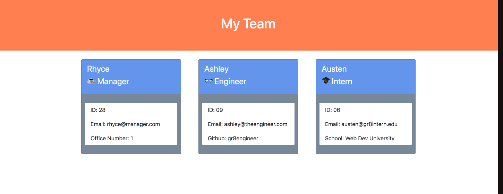

# team-profile-generator

## Welcome to the team profile generator

### Inside you will find:
* `instructions` folder containing assignment details
* `__tests__` folder containing tests for each class
* `lib` folder containing classes
* `dist` folder containing an example of a generated html page
* `src` folder containing `generateHTML` function code
* `index.js` file to run program

### To run program:
* Open integrated terminal
* Run `npm init -y`
* Run `npm i`
* Run `npm test` to make sure the classes work
* Run `node index.js` and follow the prompts

---
*video of application walkthrough*  
https://drive.google.com/file/d/1fY55VbhwUCM1z9CieQKh3KrNJMPAJO9A/view

---

*example of a generated team profile page*
